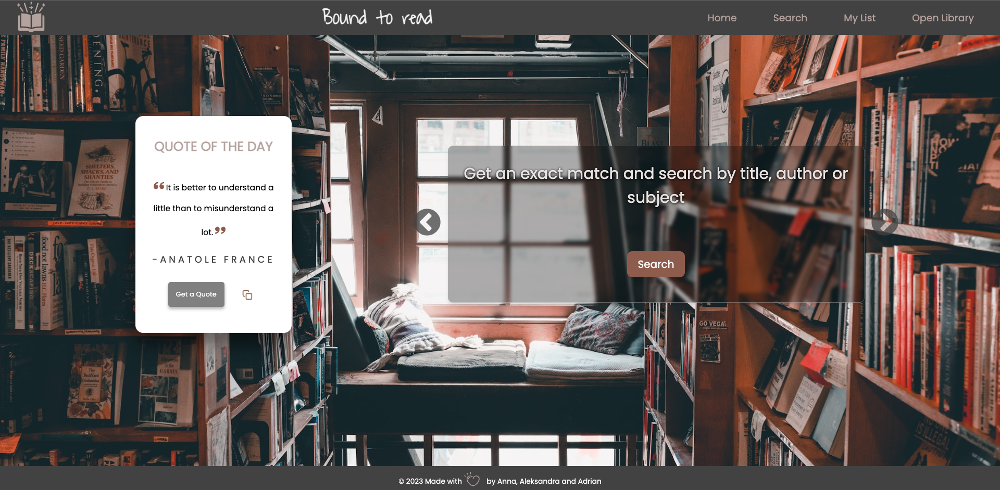

# Bound to Read 📚

## Description
Bound to Read is a beautifully designed web application that helps book enthusiasts find, explore, and manage their next great reads. With a user-friendly interface, users can easily search for books, discover information about them, and create a personalized reading list.

## List of content
* [Description](#description)
* [Screenshot](#screenshot-)
* [Deployment](#deployment-)
* [Features](#features-)
* [Technology](#technology-)
* [Contributors](#contributors-)
* [Acknowledgements](#acknowledgements-)

## Screenshot 📸

## Deployment 🚀
https://bound2read.netlify.app/

## Features 🌟
Search for books 🔍
Bound to Read offers a powerful search functionality that utilizes the Google Books API. Users can search for books by title, author, or keyword, and receive a list of relevant results.

### Book details 📖
Each book in the search results comes with essential information such as title, author, publisher, and publication date. Users can also view a thumbnail of the book cover and read a brief description to get an idea of what the book is about.

### Manage a personalized reading list 📋
Bound to Read allows users to create and manage their own reading list. By simply clicking on a book in the search results, users can add it to their list. The list can be easily reordered using a drag-and-drop interface, and books can be removed with a single click.

### Purchase books online 💳
For users who wish to purchase a physical or digital copy of a book, Bound to Read provides a direct link to the book's sale page.

### Additional book information 📕
Bound to Read offers a comprehensive view of each book's details. Users can access additional information about a book, including page count, language, and more by clicking on the info icon.

## Technology 💻
Bound to Read is built using modern web technologies, including:

* React DnD
* Google Books API
* Open Library API

## Contributors 🤝
Anna Noga
https://github.com/mrsannanoga

Alexandra Miekisiak
https://github.com/amiekisiak

Adrian Loosli
https://github.com/Aloosli

## Acknowledgements 🙏
Special thanks to Google Books API and Open Library API for providing a fantastic resource for book information.

Happy reading! 📚🎉
